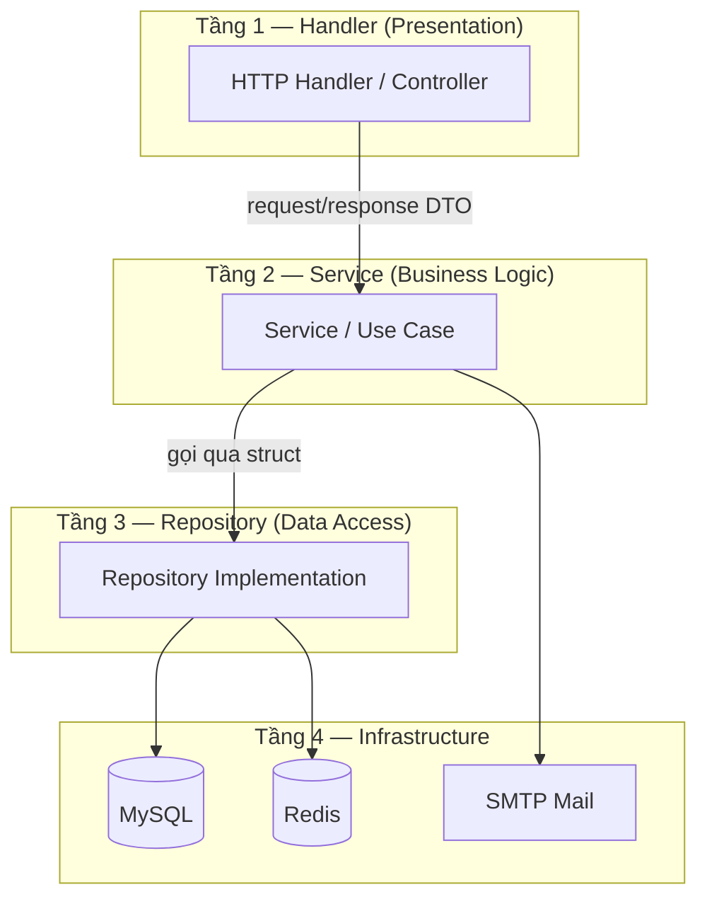

# 🛡️ UAM (User Access Management) API

[](https://go.dev/)
[](./LICENSE)
[](https://go.dev/)
[](https://github.com/Quocdev03/user_access_management/actions)


**UAM** là hệ thống backend hoàn chỉnh được xây dựng bằng **Golang** (Clean Architecture), chuyên quản lý tài khoản, xác thực đa lớp, phân quyền nâng cao (RBAC & Permission-based) và giám sát bảo mật tài khoản chuẩn doanh nghiệp.

---

## 📖 Tài liệu dự án (Quick Links)

Tài liệu chi tiết cho từng cấu phần của dự án đã được chuẩn bị đầy đủ trong thư mục [docs/](./docs):

- 📋 [Tổng quan & 40 Use Cases](./docs/01-overview.md) — Chi tiết về mục tiêu sản phẩm, đối tượng sử dụng và danh sách Use Cases.
- 🏗️ [Kiến trúc hệ thống](./docs/02-architecture.md) — Chi tiết thiết kế Clean Architecture 4 tầng, luồng xử lý request và middleware pipeline.
- 📏 [Quy ước viết code](./docs/03-coding-conventions.md) — Nguyên tắc đặt tên, quản lý lỗi, validation và xử lý concurrency.
- 🌐 [Thiết kế API RESTful](./docs/04-api-design.md) — Mô tả các endpoint, request/response payload và error codes.
- 🗄️ [Thiết kế Cơ sở dữ liệu](./docs/05-database-design.md) — Database schema, quan hệ giữa các bảng và cơ chế migration.
- ⚙️ [Cài đặt môi trường & Vận hành](./docs/07-environment-setup.md) — Hướng dẫn Docker, SMTP Resend, Live Reload (Air) và CI/CD.

---

## 🏗️ Kiến trúc & Luồng xử lý request

Hệ thống được tổ chức chặt chẽ theo mô hình **Clean Architecture 4 tầng**: `Client` → `Handler (Presentation)` → `Service (Business Logic)` → `Repository (Data Access)` → `Infrastructure (MySQL, Redis, SMTP)`.



### Middleware Pipeline

Mọi HTTP Request đi vào hệ thống đều đi qua một pipeline middleware bảo mật nghiêm ngặt trước khi đến Handler xử lý logic:

```
Request ──> Logger ──> Recovery ──> CORS ──> RateLimit (Redis) ──> Auth (JWT) ──> RBAC/Permission ──> Handler
```

---

## 🛡️ Tính năng bảo mật & Concurrency nổi bật

Dự án này triển khai các cơ chế bảo mật nâng cao để phòng chống các lỗ hổng phổ biến trong môi trường Production:

1. **Chống Race Condition & TOCTOU (Time-of-Check to Time-of-Use)**
   - Sử dụng Database Transaction kết hợp **Pessimistic Locking (`SELECT ... FOR UPDATE`)** khi xác thực mã OTP, đếm số lần đăng nhập sai và xoay vòng Refresh Token.
2. **Chống Timing Attack**
   - Áp dụng cơ chế **Dummy bcrypt hashing** khi truy vấn email không tồn tại trong hệ thống, đảm bảo thời gian phản hồi đồng đều giữa tài khoản hợp lệ và không hợp lệ.
3. **Giải quyết triệt để lỗ hổng JWT Revocation Gap**
   - Kết hợp **Redis Blacklist** khi Logout cùng cơ chế **Global User Revocation Epoch** lưu trữ trên Redis. Cho phép thu hồi lập tức tất cả Access Token đang hoạt động khi người dùng thực hiện *Logout All Devices* hoặc *Đổi mật khẩu*.
4. **Phòng chống Spam & Brute Force (Hard Ban IP)**
   - Middleware Rate Limiter bằng Redis tự động phát hiện hành vi spam trên các endpoint nhạy cảm (Đăng nhập, Đăng ký, OTP, Quên mật khẩu) và **chặn (Ban) IP tạm thời trong 15 phút**.
5. **Đăng nhập & Gửi Mail Bất đồng bộ (Concurrency)**
   - Tối ưu hóa hiệu năng bằng cách gửi mail xác minh/reset mật khẩu bất đồng bộ qua Goroutines, tăng tốc độ phản hồi API cho người dùng.

---

## 🛠️ Hướng dẫn cài đặt nhanh (Local)

### 1. Khởi động các dịch vụ phụ trợ (MySQL, Redis, Mailpit)
```bash
docker-compose up -d
```

### 2. Thiết lập cấu hình biến môi trường
Sao chép cấu hình mẫu và điều chỉnh các kết nối nếu cần thiết:
```bash
cp .env.example .env
```

### 3. Chạy Migrations (Tạo cấu trúc DB)
```bash
# Trên Windows
make.cmd migrate-up

# Trên macOS/Linux
make migrate-up
```

### 4. Khởi động API Server
Chạy ở chế độ Live-reload (sử dụng Air) hoặc chạy Go trực tiếp:
```bash
# Dùng Air (tự động reload khi sửa code)
air

# Hoặc dùng lệnh Go cơ bản
go run ./cmd/server/main.go
```
API Server sẽ lắng nghe tại: `http://localhost:8080`

### 5. Giao diện Test trực quan (UI Console)
Hệ thống tích hợp sẵn UI Tester phục vụ trực tiếp tại Root URL. Bạn chỉ cần mở trình duyệt và truy cập:
👉 **[http://localhost:8080/](http://localhost:8080/)**

Giao diện trực quan này giúp bạn dễ dàng chạy thử và kiểm tra các luồng nghiệp vụ (Đăng ký, Nhập OTP, Đăng nhập, Profile, Bảo mật...) mà không cần các công cụ ngoài như Postman.

> [!TIP]
> **Tài khoản Super Admin test nhanh:**
> - **Username:** `admin_quocdev`
> - Mật khẩu khởi tạo được ghi nhận trong file [superadmin_credentials.txt](./superadmin_credentials.txt) ở thư mục gốc.

---

## 📂 Cấu trúc thư mục dự án

```text
├── cmd
│   └── server          # Entry point khởi chạy ứng dụng (main.go)
├── docs                # Thư mục chứa tài liệu chi tiết của dự án
├── internal
│   ├── config          # Cấu hình biến môi trường và cấu trúc config
│   ├── dto             # Data Transfer Objects (Request/Response API)
│   ├── entity          # Models tương tác trực tiếp với Database
│   ├── handler         # Tầng giao tiếp HTTP (Xử lý Request/Response)
│   ├── middleware      # Bộ lọc bảo mật (Auth, Rate Limit, CORS, Logger...)
│   ├── repository      # Tầng truy xuất và thao tác CSDL (MySQL, Redis)
│   ├── router          # Định nghĩa và gom nhóm các tuyến đường API
│   └── service         # Tầng chứa logic nghiệp vụ cốt lõi
├── migrations          # File script SQL migration (golang-migrate)
├── pkg                 # Thư viện helper dùng chung (Hash, Logger, DB TxManager...)
├── ui_test             # Mã nguồn giao diện API Testing Console (serve tại root /)
└── ...
```

---

*Dự án UAM được xây dựng với mục tiêu cung cấp giải pháp xác thực và phân quyền cốt lõi vững chắc, tối ưu hóa bảo mật và sẵn sàng tích hợp cho các hệ thống phần mềm doanh nghiệp.*
