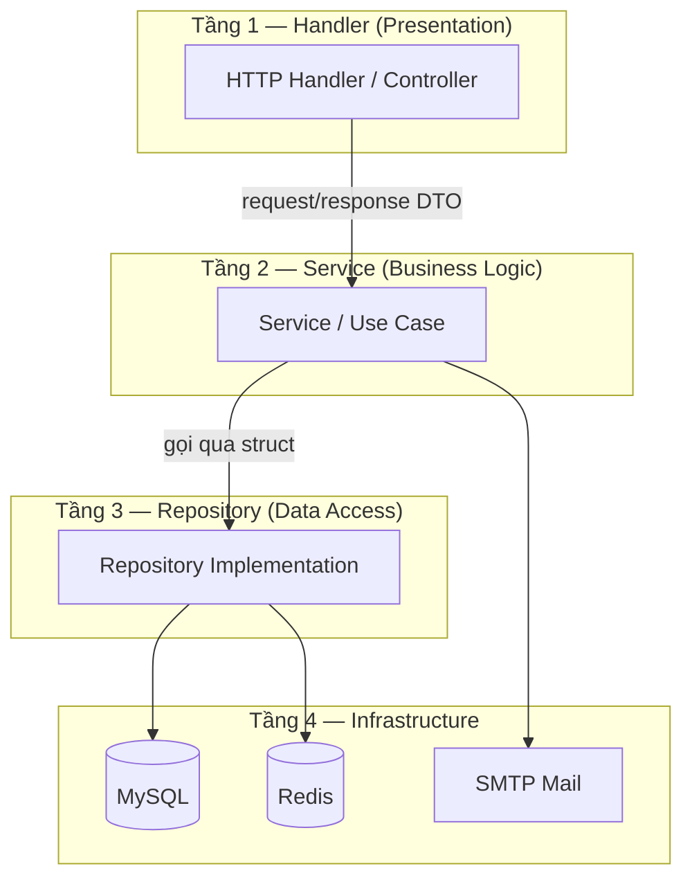
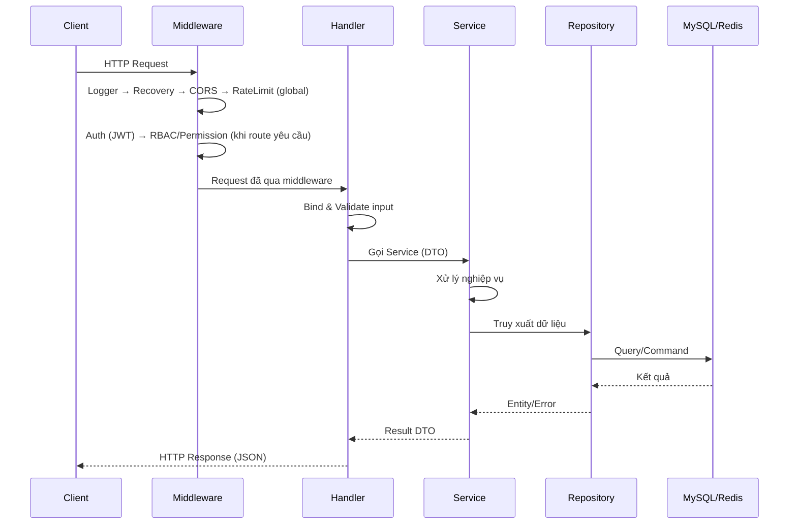

> [!IMPORTANT]
> **LƯU Ý DÀNH CHO DEVELOPER (AI & HUMAN):**
> Các tài liệu thiết kế này mang tính chất là **KHUNG ĐỊNH HƯỚNG (Framework / Guidelines)**.
> KHÔNG ĐƯỢC áp dụng một cách rập khuôn, máy móc hoặc sao chép hoàn toàn 100%.
> Tùy thuộc vào bối cảnh thực tế của task, bạn phải linh hoạt tùy biến (ví dụ: dùng Atomic Query, Pessimistic Locking FOR UPDATE cho Concurrency, hoặc cấu trúc lại struct).

# Kiến trúc hệ thống

## 1. Tổng quan

**User Access Management (UAM)** sử dụng kiến trúc **Clean Architecture** kết hợp **Repository Pattern** và **Dependency Injection**, đảm bảo tách biệt rõ ràng giữa các tầng, dễ bảo trì và mở rộng.

### Nguyên tắc thiết kế

- **Tách biệt trách nhiệm**: Mỗi tầng một vai trò; không nhảy cóc, không gọi ngược.
- **Đơn hướng**: `Handler → Service → Repository` (DI bằng concrete struct; không bắt buộc interface trừ khi có ≥2 implementation — xem `AGENTS.md`).
- **Source of truth**: endpoint/UC → `03-use-cases.md`; schema/Redis → `02-database-design.md`.

---

## 2. Kiến trúc 4 tầng



### Mô tả từng tầng

| Tầng               | Thành phần                  | Trách nhiệm                                             |
| ------------------ | --------------------------- | ------------------------------------------------------- |
| **Handler**        | HTTP Controller, Middleware | Nhận request, validate input, gọi Service, trả response |
| **Service**        | Business Logic, Use Case    | Xử lý nghiệp vụ, orchestrate giữa các Repository        |
| **Repository**     | Implementation              | Truy xuất và thao tác dữ liệu (MySQL, Redis)            |
| **Infrastructure** | Database, Cache, Mail       | Hạ tầng kỹ thuật bên ngoài                              |

---

## 3. Luồng xử lý request



---

## 4. Middleware Pipeline

Các middleware được thực thi theo thứ tự trước khi request đến Handler:

```
Request → Logger → Recovery → CORS → RateLimit → Auth (JWT) → RBAC/Permission → Handler
```

| Middleware     | Chức năng                                           |
| -------------- | --------------------------------------------------- |
| **Logger**     | Ghi log mỗi request (method, path, status, latency) |
| **Recovery**   | Bắt panic, trả 500 thay vì crash server             |
| **CORS**       | Cho phép cross-origin requests                      |
| **RateLimit**  | Redis counter + soft ban theo IP (fail-closed nếu Redis lỗi) |
| **Auth (JWT)** | Parse access token; blacklist `jti` + `user_revoked_epoch` (fail-closed); inject claims |
| **RBAC**       | `RequireRole` trên claim roles (admin routes) |
| **Permission** | Load permission từ DB theo user (admin bypass role `admin`) |

---

## 5. Cấu trúc thư mục dự án

```
user_access_management/
├── cmd/
│   └── server/
│       └── main.go                 # Entry point — khởi tạo DI, start server
├── internal/
│   ├── handler/                    # Tầng Handler (HTTP Controllers)
│   ├── service/                    # Tầng Service (Business Logic)
│   ├── repository/                 # Tầng Repository (Data Access)
│   ├── dto/                        # Data Transfer Objects (Request/Response)
│   ├── middleware/                 # Middleware
│   ├── router/                     # Định tuyến API
│   ├── worker/                     # Background tasks
│   ├── constant/                   # Constants dùng chung
│   └── config/                     # Cấu hình ứng dụng
├── pkg/                            # Shared utilities (có thể tái sử dụng)
│   ├── apperror/                   # Tập trung định nghĩa lỗi (Errors)
│   ├── database/                   # Quản lý Connection pool và Transaction Manager
│   ├── validator/                  # Custom validators
│   ├── jwt/                        # JWT helper
│   ├── hash/                       # bcrypt helper
│   └── logger/                     # Zap logger wrapper
├── migrations/                     # Database migration files (golang-migrate)
├── docs/                           # Tài liệu dự án
├── docker-compose.yml
├── Dockerfile
├── Makefile
├── .env.example
├── go.mod
└── go.sum
```

### Giải thích thư mục chính

| Thư mục                | Vai trò                                                                             |
| ---------------------- | ----------------------------------------------------------------------------------- |
| `cmd/server/`          | Entry point — khởi tạo dependency injection, background worker, router, HTTP server |
| `internal/handler/`    | Nhận HTTP request, validate, gọi service, trả JSON response                         |
| `internal/service/`    | Chứa toàn bộ business logic, gọi repository qua con trỏ struct                      |
| `internal/repository/` | Thao tác database (MySQL) và cache (Redis)                                          |
| `internal/model/`      | Định nghĩa entity/domain model tương ứng với bảng database                          |
| `internal/dto/`        | Định nghĩa cấu trúc request/response, tách biệt với model                           |
| `internal/middleware/` | Xử lý xác thực, phân quyền, rate limit, logging                                     |
| `internal/router/`     | Khởi tạo cấu hình và thiết lập các Sub-Router                                       |
| `internal/worker/`     | Quản lý các task chạy ngầm (VD: cleanup database)                                   |
| `internal/constant/`   | Khai báo hằng số hệ thống tránh hard-code                                           |
| `internal/config/`     | Đọc và quản lý cấu hình từ .env                                                     |
| `pkg/`                 | Các utility dùng chung (JWT, Hash, Validator)                                       |
| `migrations/`          | File SQL migration quản lý bởi golang-migrate                                       |

---
