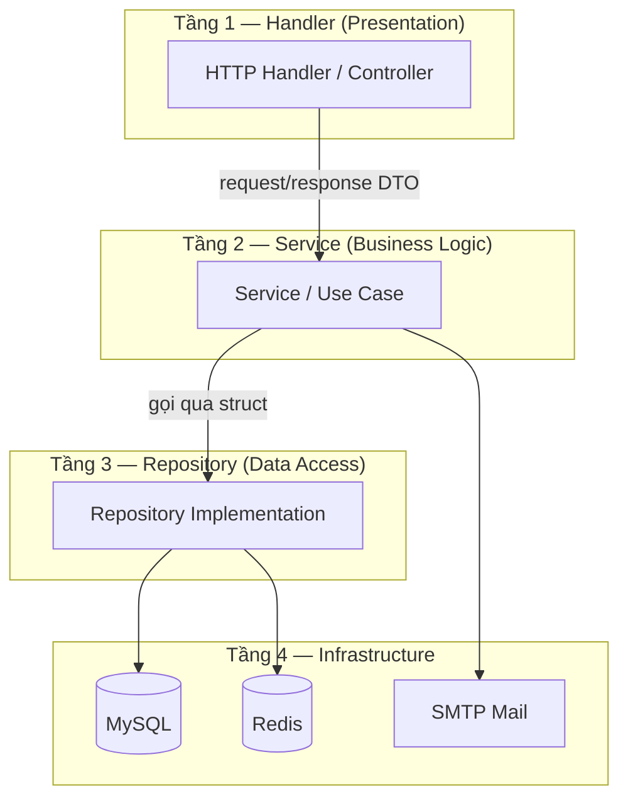
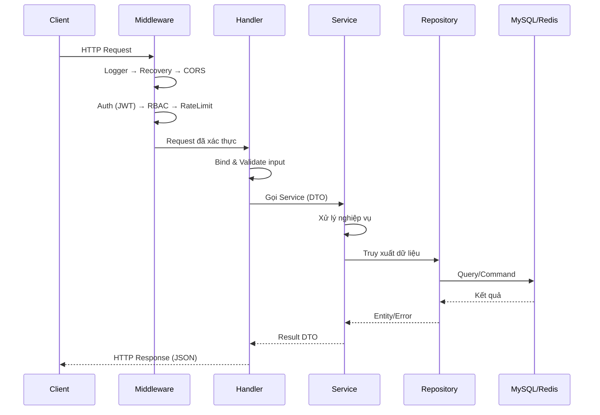

> [!IMPORTANT]
> **LƯU Ý DÀNH CHO DEVELOPER (AI & HUMAN):**
> Các tài liệu thiết kế này mang tính chất là **KHUNG ĐỊNH HƯỚNG (Framework / Guidelines)**.
> KHÔNG ĐƯỢC áp dụng một cách rập khuôn, máy móc hoặc sao chép hoàn toàn 100%.
> Tùy thuộc vào bối cảnh thực tế của task, bạn phải linh hoạt tùy biến (ví dụ: dùng Atomic Query, Pessimistic Locking FOR UPDATE cho Concurrency, hoặc cấu trúc lại struct).

# Kiến trúc hệ thống

## 1. Tổng quan

**User Access Management (UAM)** sử dụng kiến trúc **Clean Architecture** kết hợp **Repository Pattern** và **Dependency Injection**, đảm bảo tách biệt rõ ràng giữa các tầng, dễ bảo trì và mở rộng.

### Nguyên tắc thiết kế

- **Tách biệt trách nhiệm**: Mỗi tầng có vai trò riêng biệt, không phụ thuộc chéo.
- **Dependency Inversion**: Tầng trên không phụ thuộc tầng dưới, mà phụ thuộc vào interface.
- **Đơn hướng**: Luồng phụ thuộc chỉ đi từ ngoài vào trong (Handler → Service → Repository).

---

## 2. Kiến trúc 4 tầng



### Mô tả từng tầng

| Tầng | Thành phần | Trách nhiệm |
|------|-----------|-------------|
| **Handler** | HTTP Controller, Middleware | Nhận request, validate input, gọi Service, trả response |
| **Service** | Business Logic, Use Case | Xử lý nghiệp vụ, orchestrate giữa các Repository |
| **Repository** | Implementation | Truy xuất và thao tác dữ liệu (MySQL, Redis) |
| **Infrastructure** | Database, Cache, Mail | Hạ tầng kỹ thuật bên ngoài |

---

## 3. Luồng xử lý request



---

## 4. Middleware Pipeline

Các middleware được thực thi theo thứ tự trước khi request đến Handler:

```
Request → Logger → Recovery → CORS → RateLimit → Auth (JWT) → RBAC/Permission → Handler
```

| Middleware | Chức năng |
|-----------|----------|
| **Logger** | Ghi log mỗi request (method, path, status, latency) |
| **Recovery** | Bắt panic, trả 500 thay vì crash server |
| **CORS** | Cho phép cross-origin requests |
| **RateLimit** | Giới hạn số request/phút bằng Redis |
| **Auth (JWT)** | Xác thực access token, inject user info vào context |
| **RBAC** | Kiểm tra role của user có quyền truy cập endpoint |
| **Permission** | Kiểm tra permission cụ thể |

---

## 5. Cấu trúc thư mục dự án

```
user_access_management/
├── cmd/
│   └── server/
│       └── main.go                 # Entry point — khởi tạo DI, start server
├── internal/
│   ├── handler/                    # Tầng Handler (HTTP Controllers)
│   │   ├── auth_handler.go
│   │   ├── user_handler.go
│   │   ├── admin_handler.go
│   │   └── health_handler.go
│   ├── service/                    # Tầng Service (Business Logic)
│   │   ├── auth_service.go
│   │   ├── user_service.go
│   │   ├── admin_service.go
│   │   ├── mail_service.go
│   │   ├── otp_service.go
│   │   └── audit_service.go
│   ├── repository/                 # Tầng Repository (Data Access)
│   │   ├── user_repository.go
│   │   ├── role_repository.go
│   │   ├── session_repository.go
│   │   ├── otp_repository.go
│   │   ├── password_repository.go
│   │   └── audit_repository.go
│   ├── model/                      # Entity / Domain Model
│   │   ├── user_model.go
│   │   ├── role_model.go
│   │   ├── permission_model.go
│   │   ├── session_model.go
│   │   ├── otp_model.go
│   │   └── audit_log_model.go
│   ├── dto/                        # Data Transfer Objects (Request/Response)
│   │   ├── auth_dto.go
│   │   ├── user_dto.go
│   │   └── admin_dto.go
│   ├── middleware/                 # Middleware
│   │   ├── auth_middleware.go
│   │   ├── rbac_middleware.go
│   │   ├── rate_limit_middleware.go
│   │   └── logger_middleware.go
│   ├── router/                     # Định tuyến API
│   │   ├── router.go
│   │   ├── auth_routes.go
│   │   └── user_routes.go
│   ├── worker/                     # Background tasks
│   │   └── cleanup.go
│   ├── constant/                   # Constants dùng chung
│   │   └── constant.go
│   └── config/                     # Cấu hình ứng dụng
│       └── config.go
├── pkg/                            # Shared utilities (có thể tái sử dụng)
│   ├── response/                   # Response format chuẩn
│   ├── apperror/                   # Tập trung định nghĩa lỗi (Errors)
│   ├── database/                   # Quản lý Connection pool và Transaction Manager
│   ├── validator/                  # Custom validators
│   ├── jwt/                        # JWT helper
│   ├── hash/                       # bcrypt helper
│   └── logger/                     # Zap logger wrapper
├── migrations/                     # Database migration files (golang-migrate)
│   ├── 000001_create_users.up.sql
│   └── 000001_create_users.down.sql
├── docs/                           # Tài liệu dự án
├── docker-compose.yml
├── Dockerfile
├── Makefile
├── .env.example
├── go.mod
└── go.sum
```

### Giải thích thư mục chính

| Thư mục | Vai trò |
|---------|--------|
| `cmd/server/` | Entry point — khởi tạo dependency injection, background worker, router, HTTP server |
| `internal/handler/` | Nhận HTTP request, validate, gọi service, trả JSON response |
| `internal/service/` | Chứa toàn bộ business logic, gọi repository qua con trỏ struct |
| `internal/repository/` | Thao tác database (MySQL) và cache (Redis) |
| `internal/model/` | Định nghĩa entity/domain model tương ứng với bảng database |
| `internal/dto/` | Định nghĩa cấu trúc request/response, tách biệt với model |
| `internal/middleware/` | Xử lý xác thực, phân quyền, rate limit, logging |
| `internal/router/` | Khởi tạo cấu hình và thiết lập các Sub-Router |
| `internal/worker/` | Quản lý các task chạy ngầm (VD: cleanup database) |
| `internal/constant/` | Khai báo hằng số hệ thống tránh hard-code |
| `internal/config/` | Đọc và quản lý cấu hình từ .env |
| `pkg/` | Các utility dùng chung (JWT, Hash, Validator) |
| `migrations/` | File SQL migration quản lý bởi golang-migrate |

---

## 6. Dependency Injection

Tất cả dependency được khởi tạo tại `cmd/server/main.go` và inject qua constructor:

```
main.go
  ├── config.Load()
  ├── db.Connect()          → *sqlx.DB
  ├── redis.Connect()       → *redis.Client
  ├── NewTxManager(db)      → *database.TxManager
  │
  ├── NewUserRepository(db)           → *repository.UserRepository
  ├── NewRoleRepository(db)           → *repository.RoleRepository
  ├── NewSessionRepository(redis)     → *repository.SessionRepository
  ├── NewOTPRepository(db)            → *repository.OTPRepository
  ├── NewPasswordRepository(db)       → *repository.PasswordRepository
  │
  ├── NewOTPService(...)              → *service.OTPService
  ├── NewAuthService(...)             → *service.AuthService
  ├── NewPasswordService(...)         → *service.PasswordService
  ├── NewUserService(userRepo)        → *service.UserService
  ├── NewAdminService(...)            → *service.AdminService
  │
  ├── NewCleanupWorker(...)           → *worker.CleanupWorker
  ├── go worker.Start()               → [Background Routine]
  │
  ├── NewAuthHandler(authSvc, pwdSvc) → *handler.AuthHandler
  ├── NewUserHandler(userService)     → *handler.UserHandler
  ├── NewAdminHandler(adminService)   → *handler.AdminHandler
  │
  └── router.Setup(db, redisClient, logger, cfg)
        └── srv.ListenAndServe()
```

> **Lưu ý**: Không sử dụng DI framework. Inject thủ công qua constructor bằng con trỏ struct (Concrete Types) đảm bảo rõ ràng, tránh rườm rà (Interface Sprawl) và dễ debug.
