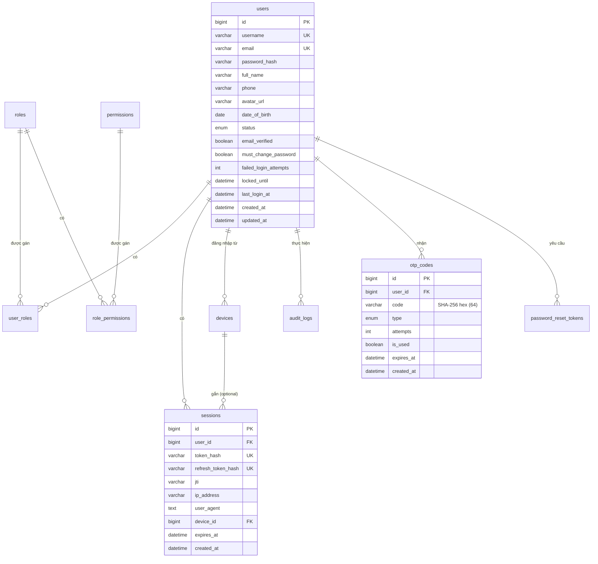

> [!IMPORTANT]
> **Nguồn sự thật (source of truth):** thư mục `migrations/*.sql` + model/repo trong code.
> Tài liệu này là khung định hướng — khi lệch, **ưu tiên code/migration**.

# Thiết kế Database

## 1. Tổng quan

| Thành phần | Vai trò |
|------------|---------|
| **MySQL 8** | Dữ liệu chính: users, RBAC, **sessions**, devices, OTP (hash), password reset, audit |
| **Redis** | State ngắn hạn: JWT blacklist (`jti`), revoke epoch, refresh reuse, rate-limit/ban, pending email change |
| **golang-migrate** | Schema versioning (`migrations/`) — **single source**, không dùng dump `database.sql` |

Session **không** lưu full token plaintext. MySQL giữ hash; Redis thu hồi access theo `jti` / epoch.

---

## 2. Sơ đồ quan hệ (ERD)



---

## 3. Chi tiết bảng (khớp migration)

### 3.1 `users`

| Cột | Kiểu | Ghi chú |
|-----|------|---------|
| `id` | BIGINT UNSIGNED PK | |
| `username` | VARCHAR(50) UNIQUE NOT NULL | |
| `email` | VARCHAR(255) UNIQUE NOT NULL | Login bằng **email** |
| `password_hash` | VARCHAR(255) NOT NULL | bcrypt |
| `full_name` | VARCHAR(100) NOT NULL | |
| `phone` | VARCHAR(20) NOT NULL | |
| `avatar_url` | VARCHAR(500) NULL | URL dạng `/uploads/avatars/...` |
| `date_of_birth` | DATE NOT NULL | |
| `status` | ENUM(`active`,`inactive`,`locked`) | Default `inactive` khi đăng ký |
| `email_verified` | BOOLEAN | |
| `must_change_password` | BOOLEAN | Sau admin reset / seed local admin |
| `failed_login_attempts` | INT/TINYINT | Brute-force counter |
| `locked_until` | DATETIME NULL | Hết hạn thì có thể unlock |
| `last_login_at` | DATETIME NULL | |
| `created_at` / `updated_at` | DATETIME | |

### 3.2 RBAC: `roles`, `permissions`, `user_roles`, `role_permissions`

- Roles hệ thống seed: `admin`, `moderator`, `user` — **không được xóa** qua API.
- Permission format: `{resource}.{action}` (vd `users.read`, `roles.assign`).
- UNIQUE `(user_id, role_id)`, UNIQUE `(role_id, permission_id)`.

### 3.3 `sessions`

| Cột | Kiểu | Ghi chú |
|-----|------|---------|
| `token_hash` | VARCHAR(255) UK | SHA-256 access token |
| `refresh_token_hash` | VARCHAR(255) UK | SHA-256 refresh token |
| **`jti`** | VARCHAR(36) NULL | JWT ID access token — dùng blacklist khi revoke **1** session |
| `device_id` | BIGINT NULL | FK devices (thêm sau khi tạo bảng devices) |
| `expires_at` | DATETIME | Theo refresh TTL |

**Invalidation thống nhất (code):** `SessionRepository.InvalidateUserSessions` =
1. `DELETE` mọi row session của user (MySQL)
2. Set Redis `user_revoked_epoch:{userID}` (access JWT có `iat` trước epoch → reject)

Gọi khi: logout-all, đổi/reset password, lock/inactive, đổi email, gán/gỡ role, refresh-token reuse.

### 3.4 `devices`

Ghi nhận thiết bị lúc login (`FindOrCreate`). API: `GET /users/me/devices`.

### 3.5 `otp_codes`

| Cột | Kiểu | Ghi chú |
|-----|------|---------|
| **`code`** | **VARCHAR(64)** | **Hash** `SHA256(otp + pepper)` — **không** lưu OTP plaintext |
| `type` | ENUM | `email_verification`, `forgot_password` *(legacy enum, app không dùng OTP cho forgot)*, `change_email`, `change_email_old`, `change_email_new` |
| `attempts` / `is_used` / `expires_at` | | Max attempts / expiry từ config (`OTP_MAX_ATTEMPTS`, `OTP_EXPIRY`) |

Pepper: `OTP_PEPPER` (fallback `JWT_SECRET`).

### 3.6 `password_reset_tokens`

Lưu **hash** token reset (link email), TTL ~1h. Forgot password **không** dùng OTP type.

### 3.7 `audit_logs`

Hành động quan trọng (login, admin update, v.v.). Fail ghi log → warn, không fail request.

---

## 4. Indexes (chính)

- `users`: unique username/email; filter status/created khi list admin
- `sessions`: `user_id`, `jti`, `expires_at`; unique token hashes
- `otp_codes`: `(user_id, type)`, `expires_at`
- `password_reset_tokens`: `user_id`, `expires_at`
- `audit_logs`: `user_id`, `action`, `created_at`

Chi tiết exact index: xem từng file migration.

---

## 5. Redis — key thực tế trong code

| Key pattern | Mục đích | TTL |
|-------------|----------|-----|
| `blacklist:{jti}` | Thu hồi **một** access token | Còn lại của access token / access expiry |
| `user_revoked_epoch:{userID}` | Thu hồi **mọi** access phát hành trước epoch | Thường = refresh expiry |
| `revoked_rt:{hash}` | Refresh token đã rotate / chống reuse | Còn lại của RT |
| `ratelimit:...` | Đếm rate limit (middleware + service) | Window |
| `ip_ban:{ip}` | Ban IP khi vượt hard limit | Ban duration (vd 15m) |
| `email_change_pending:{userID}` | Email mới chờ OTP | ~15m |

**Không** dùng Redis làm primary session store. Auth middleware: parse JWT → check blacklist jti → check revoked epoch (fail-closed nếu Redis lỗi).

---

## 6. Migration

Single source: `migrations/`.

```text
migrations/
├── 000001_create_users_table
├── 000002_create_roles_table
├── 000003_create_permissions_table
├── 000004_create_user_roles_table
├── 000005_create_role_permissions_table
├── 000006_create_sessions_table      # có cột jti
├── 000007_create_devices_table       # + FK sessions.device_id
├── 000008_create_otp_codes_table     # code VARCHAR(64)
├── 000009_create_password_reset_tokens_table
├── 000010_create_audit_logs_table
├── 000011_seed_roles_and_permissions
├── 000012_seed_superadmin            # admin_local (bootstrap local)
├── 000013_add_must_change_password_to_users
├── 000014_add_users_notify_permission
└── 000015_seed_admin_must_change_password
```

### Quy tắc

- Mỗi version: `.up.sql` + `.down.sql`.
- **Không** sửa migration đã apply trên môi trường dùng chung — thêm version mới.
- Local recreate OK: `docker compose down -v` rồi migrate lại.

### Seed admin bootstrap (migration 000012) — **một tài khoản duy nhất**

| Field | Value | Ghi chú |
|-------|--------|---------|
| **Email** | `admin@localhost.local` | **Dùng để login** (`POST /auth/login`) |
| **Password** | `LocalDev@ChangeMe1` | bcrypt trong seed |
| Username | `admin_local` | Chỉ định danh DB, **không** dùng login |
| Role | `admin` (role_id=1) | Tên role RBAC, khác username |
| Status | `active`, email verified | Login thẳng được |

Không còn `admin_quocdev` / file credentials. Đổi password sau khi test.

### Thứ tự FK

`sessions` tạo trước `devices`; FK `device_id` gắn ở migration devices.
