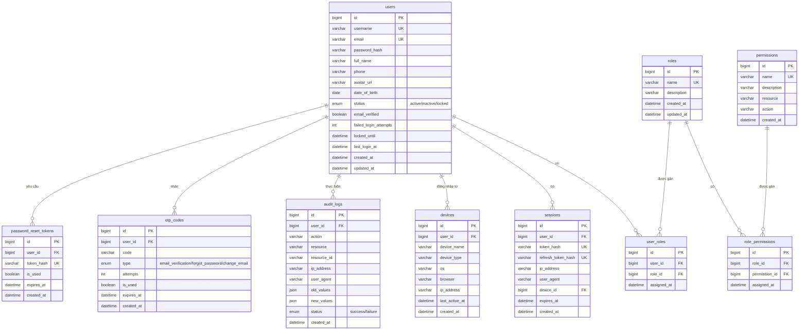

# Thiết kế Database

## 1. Tổng quan

Hệ thống sử dụng **MySQL 8** làm cơ sở dữ liệu chính, **Redis** làm cache và session store. Quản lý migration bằng **golang-migrate**.

---

## 2. Sơ đồ quan hệ (ERD)



---

## 3. Chi tiết từng bảng

### 3.1 `users` — Người dùng

| Cột | Kiểu | Ràng buộc | Mô tả |
|-----|------|-----------|-------|
| `id` | BIGINT | PK, AUTO_INCREMENT | Khóa chính |
| `username` | VARCHAR(50) | UNIQUE, NOT NULL | Tên đăng nhập |
| `email` | VARCHAR(255) | UNIQUE, NOT NULL | Email |
| `password_hash` | VARCHAR(255) | NOT NULL | Mật khẩu đã mã hóa (bcrypt) |
| `full_name` | VARCHAR(100) | | Họ tên đầy đủ |
| `phone` | VARCHAR(20) | | Số điện thoại |
| `avatar_url` | VARCHAR(500) | | Đường dẫn ảnh đại diện |
| `date_of_birth` | DATE | NULL | Ngày tháng năm sinh |
| `status` | ENUM('active','inactive','locked') | DEFAULT 'inactive' | Trạng thái tài khoản |
| `email_verified` | BOOLEAN | DEFAULT FALSE | Đã xác thực email chưa |
| `failed_login_attempts` | INT | DEFAULT 0 | Số lần đăng nhập thất bại liên tiếp |
| `locked_until` | DATETIME | NULL | Thời điểm mở khóa (nếu bị lock) |
| `last_login_at` | DATETIME | NULL | Lần đăng nhập gần nhất |
| `created_at` | DATETIME | DEFAULT CURRENT_TIMESTAMP | Ngày tạo |
| `updated_at` | DATETIME | ON UPDATE CURRENT_TIMESTAMP | Ngày cập nhật |

### 3.2 `roles` — Vai trò

| Cột | Kiểu | Ràng buộc | Mô tả |
|-----|------|-----------|-------|
| `id` | BIGINT | PK, AUTO_INCREMENT | Khóa chính |
| `name` | VARCHAR(50) | UNIQUE, NOT NULL | Tên vai trò (`admin`, `moderator`, `user`) |
| `description` | VARCHAR(255) | | Mô tả vai trò |
| `created_at` | DATETIME | DEFAULT CURRENT_TIMESTAMP | Ngày tạo |
| `updated_at` | DATETIME | ON UPDATE CURRENT_TIMESTAMP | Ngày cập nhật |

### 3.3 `permissions` — Quyền hạn

| Cột | Kiểu | Ràng buộc | Mô tả |
|-----|------|-----------|-------|
| `id` | BIGINT | PK, AUTO_INCREMENT | Khóa chính |
| `name` | VARCHAR(100) | UNIQUE, NOT NULL | Tên quyền (VD: `users.read`, `users.update`) |
| `description` | VARCHAR(255) | | Mô tả quyền |
| `resource` | VARCHAR(50) | NOT NULL | Tài nguyên (VD: `users`, `roles`, `audit_logs`) |
| `action` | VARCHAR(50) | NOT NULL | Hành động (VD: `read`, `create`, `update`, `delete`) |
| `created_at` | DATETIME | DEFAULT CURRENT_TIMESTAMP | Ngày tạo |

### 3.4 `user_roles` — Gán vai trò cho người dùng

| Cột | Kiểu | Ràng buộc | Mô tả |
|-----|------|-----------|-------|
| `id` | BIGINT | PK, AUTO_INCREMENT | Khóa chính |
| `user_id` | BIGINT | FK → users.id, NOT NULL | Người dùng |
| `role_id` | BIGINT | FK → roles.id, NOT NULL | Vai trò |
| `assigned_at` | DATETIME | DEFAULT CURRENT_TIMESTAMP | Ngày gán |

> **Ràng buộc**: UNIQUE(user_id, role_id) — mỗi user chỉ gán 1 lần cho mỗi role.

### 3.5 `role_permissions` — Gán quyền cho vai trò

| Cột | Kiểu | Ràng buộc | Mô tả |
|-----|------|-----------|-------|
| `id` | BIGINT | PK, AUTO_INCREMENT | Khóa chính |
| `role_id` | BIGINT | FK → roles.id, NOT NULL | Vai trò |
| `permission_id` | BIGINT | FK → permissions.id, NOT NULL | Quyền hạn |
| `assigned_at` | DATETIME | DEFAULT CURRENT_TIMESTAMP | Ngày gán |

> **Ràng buộc**: UNIQUE(role_id, permission_id)

### 3.6 `sessions` — Phiên đăng nhập

| Cột | Kiểu | Ràng buộc | Mô tả |
|-----|------|-----------|-------|
| `id` | BIGINT | PK, AUTO_INCREMENT | Khóa chính |
| `user_id` | BIGINT | FK → users.id, NOT NULL | Người dùng |
| `token_hash` | VARCHAR(255) | UNIQUE, NOT NULL | Hash của access token |
| `refresh_token_hash` | VARCHAR(255) | UNIQUE, NOT NULL | Hash của refresh token |
| `ip_address` | VARCHAR(45) | | Địa chỉ IP |
| `user_agent` | VARCHAR(500) | | Thông tin trình duyệt |
| `device_id` | BIGINT | FK → devices.id, NULL | Thiết bị liên kết |
| `expires_at` | DATETIME | NOT NULL | Thời điểm hết hạn |
| `created_at` | DATETIME | DEFAULT CURRENT_TIMESTAMP | Ngày tạo |

### 3.7 `devices` — Thiết bị đăng nhập

| Cột | Kiểu | Ràng buộc | Mô tả |
|-----|------|-----------|-------|
| `id` | BIGINT | PK, AUTO_INCREMENT | Khóa chính |
| `user_id` | BIGINT | FK → users.id, NOT NULL | Người dùng |
| `device_name` | VARCHAR(100) | | Tên thiết bị |
| `device_type` | VARCHAR(50) | | Loại thiết bị (mobile, desktop, tablet) |
| `os` | VARCHAR(50) | | Hệ điều hành |
| `browser` | VARCHAR(50) | | Trình duyệt |
| `ip_address` | VARCHAR(45) | | Địa chỉ IP |
| `last_active_at` | DATETIME | | Lần hoạt động gần nhất |
| `created_at` | DATETIME | DEFAULT CURRENT_TIMESTAMP | Ngày tạo |

### 3.8 `otp_codes` — Mã OTP

| Cột | Kiểu | Ràng buộc | Mô tả |
|-----|------|-----------|-------|
| `id` | BIGINT | PK, AUTO_INCREMENT | Khóa chính |
| `user_id` | BIGINT | FK → users.id, NOT NULL | Người dùng |
| `code` | VARCHAR(10) | NOT NULL | Mã OTP (6 ký tự) |
| `type` | ENUM('email_verification', 'forgot_password', 'change_email') | NOT NULL | Loại OTP |
| `attempts` | INT | DEFAULT 0 | Số lần nhập sai |
| `is_used` | BOOLEAN | DEFAULT FALSE | Đã sử dụng chưa |
| `expires_at` | DATETIME | NOT NULL | Thời điểm hết hạn |
| `created_at` | DATETIME | DEFAULT CURRENT_TIMESTAMP | Ngày tạo |

### 3.9 `password_reset_tokens` — Token đặt lại mật khẩu

| Cột | Kiểu | Ràng buộc | Mô tả |
|-----|------|-----------|-------|
| `id` | BIGINT | PK, AUTO_INCREMENT | Khóa chính |
| `user_id` | BIGINT | FK → users.id, NOT NULL | Người dùng |
| `token_hash` | VARCHAR(255) | UNIQUE, NOT NULL | Hash của token |
| `is_used` | BOOLEAN | DEFAULT FALSE | Đã sử dụng chưa |
| `expires_at` | DATETIME | NOT NULL | Thời điểm hết hạn |
| `created_at` | DATETIME | DEFAULT CURRENT_TIMESTAMP | Ngày tạo |

### 3.10 `audit_logs` — Nhật ký kiểm toán

| Cột | Kiểu | Ràng buộc | Mô tả |
|-----|------|-----------|-------|
| `id` | BIGINT | PK, AUTO_INCREMENT | Khóa chính |
| `user_id` | BIGINT | FK → users.id, NULL | Người thực hiện (NULL nếu system) |
| `action` | VARCHAR(50) | NOT NULL | Hành động (VD: `login`, `update_profile`, `lock_user`) |
| `resource` | VARCHAR(50) | | Tài nguyên bị tác động |
| `resource_id` | VARCHAR(50) | | ID tài nguyên bị tác động |
| `ip_address` | VARCHAR(45) | | Địa chỉ IP |
| `user_agent` | VARCHAR(500) | | Thông tin trình duyệt |
| `old_values` | JSON | NULL | Giá trị cũ (trước khi thay đổi) |
| `new_values` | JSON | NULL | Giá trị mới (sau khi thay đổi) |
| `status` | ENUM('success', 'failure') | NOT NULL | Kết quả |
| `created_at` | DATETIME | DEFAULT CURRENT_TIMESTAMP | Thời điểm |

---

## 4. Indexes

```sql
-- users
CREATE INDEX idx_users_status ON users(status);
CREATE INDEX idx_users_email_verified ON users(email_verified);

-- user_roles
CREATE INDEX idx_user_roles_user_id ON user_roles(user_id);
CREATE INDEX idx_user_roles_role_id ON user_roles(role_id);

-- role_permissions
CREATE INDEX idx_role_permissions_role_id ON role_permissions(role_id);

-- sessions
CREATE INDEX idx_sessions_user_id ON sessions(user_id);
CREATE INDEX idx_sessions_expires_at ON sessions(expires_at);

-- devices
CREATE INDEX idx_devices_user_id ON devices(user_id);

-- otp_codes
CREATE INDEX idx_otp_codes_user_id_type ON otp_codes(user_id, type);
CREATE INDEX idx_otp_codes_expires_at ON otp_codes(expires_at);

-- password_reset_tokens
CREATE INDEX idx_password_reset_tokens_user_id ON password_reset_tokens(user_id);
CREATE INDEX idx_password_reset_tokens_expires_at ON password_reset_tokens(expires_at);

-- audit_logs
CREATE INDEX idx_audit_logs_user_id ON audit_logs(user_id);
CREATE INDEX idx_audit_logs_action ON audit_logs(action);
CREATE INDEX idx_audit_logs_created_at ON audit_logs(created_at);
CREATE INDEX idx_audit_logs_resource ON audit_logs(resource, resource_id);
```

---

## 5. Redis — Dữ liệu lưu trữ

Redis không lưu dữ liệu lâu dài. Chỉ dùng cho cache và dữ liệu tạm:

| Key Pattern | Kiểu | TTL | Mô tả |
|-------------|------|-----|-------|
| `session:{user_id}:{token_hash}` | String | 15 phút | Access token session |
| `refresh:{user_id}:{refresh_hash}` | String | 7 ngày | Refresh token |
| `user_sessions:{user_id}` | Set | 7 ngày | Tập hợp session IDs của user |
| `rate_limit:{ip}:{endpoint}` | String (counter) | 1 phút | Đếm số request cho rate limiting |
| `otp:{user_id}:{type}` | String | 5 phút | Cache OTP đang active |
| `blacklist:{token_hash}` | String | Bằng TTL token gốc | Token đã bị revoke |

---

## 6. Chiến lược Migration

Sử dụng **golang-migrate** với file SQL:

```
migrations/
├── 000001_create_users_table.up.sql
├── 000001_create_users_table.down.sql
├── 000002_create_roles_table.up.sql
├── 000002_create_roles_table.down.sql
├── 000003_create_permissions_table.up.sql
├── 000003_create_permissions_table.down.sql
├── 000004_create_user_roles_table.up.sql
├── 000004_create_user_roles_table.down.sql
├── 000005_create_role_permissions_table.up.sql
├── 000005_create_role_permissions_table.down.sql
├── 000006_create_sessions_table.up.sql
├── 000006_create_sessions_table.down.sql
├── 000007_create_devices_table.up.sql
├── 000007_create_devices_table.down.sql
├── 000008_create_otp_codes_table.up.sql
├── 000008_create_otp_codes_table.down.sql
├── 000009_create_password_reset_tokens_table.up.sql
├── 000009_create_password_reset_tokens_table.down.sql
├── 000010_create_audit_logs_table.up.sql
├── 000010_create_audit_logs_table.down.sql
├── 000011_seed_roles_and_permissions.up.sql
└── 000011_seed_roles_and_permissions.down.sql
```

### Quy tắc migration

- Mỗi migration có file `.up.sql` (tạo) và `.down.sql` (rollback).
- Đánh số tuần tự: `000001`, `000002`, ...
- Tên file mô tả rõ hành động: `create_xxx_table`, `add_xxx_column`, `seed_xxx`.
- **Không** sửa migration đã chạy trên môi trường khác. Tạo migration mới để thay đổi.
