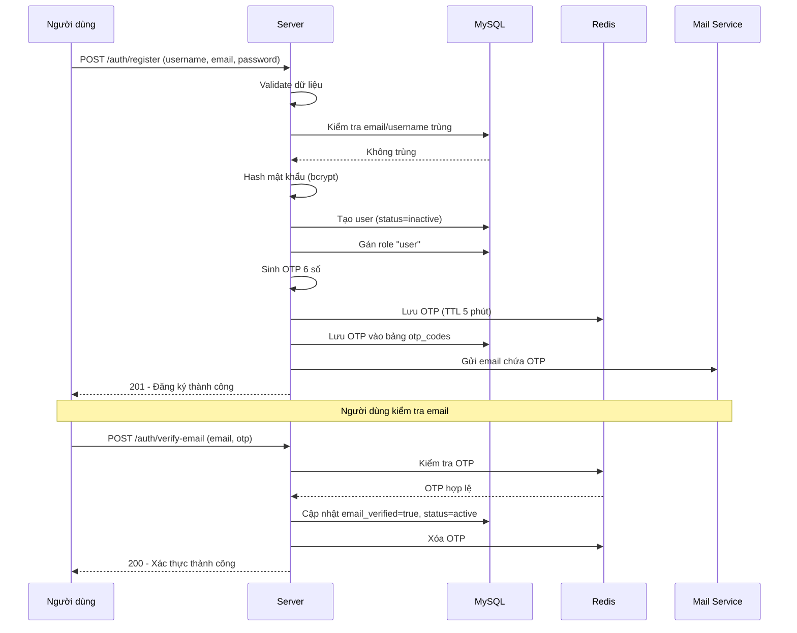
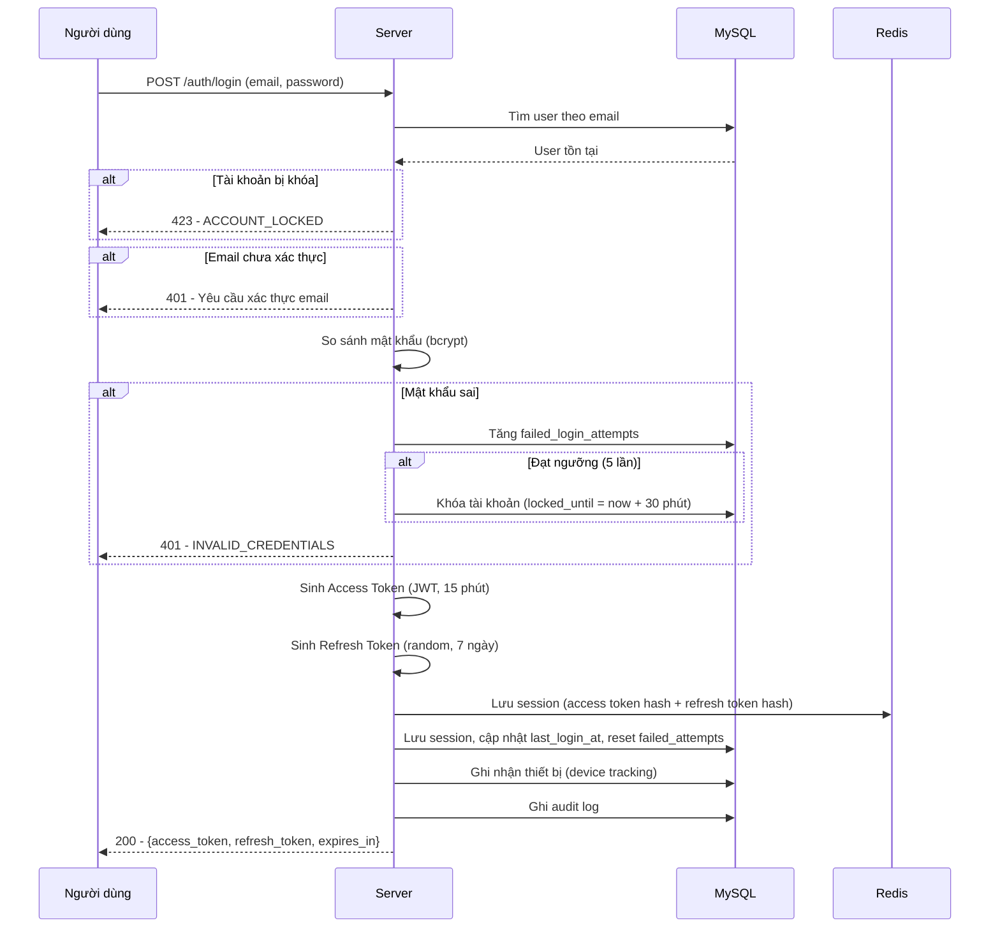
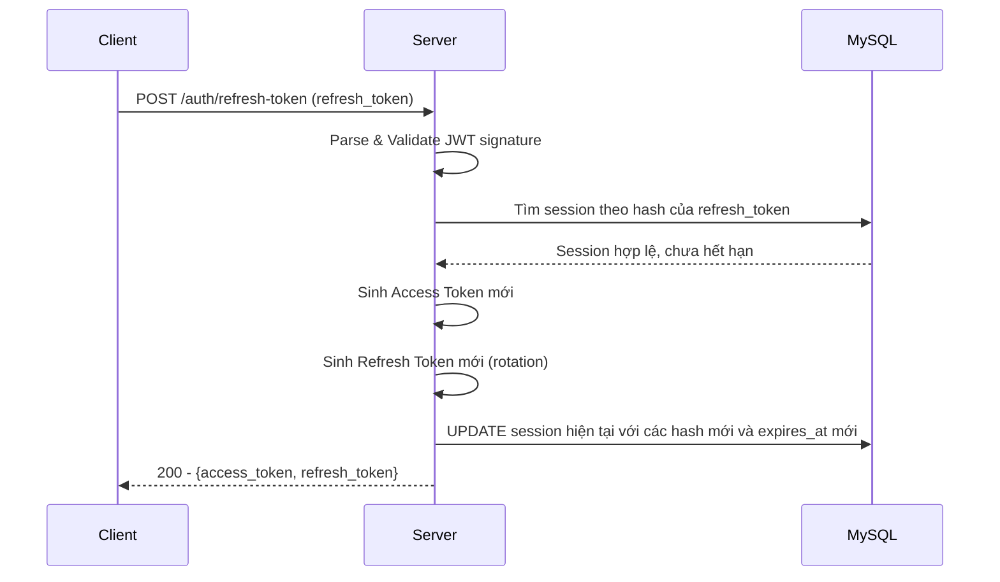
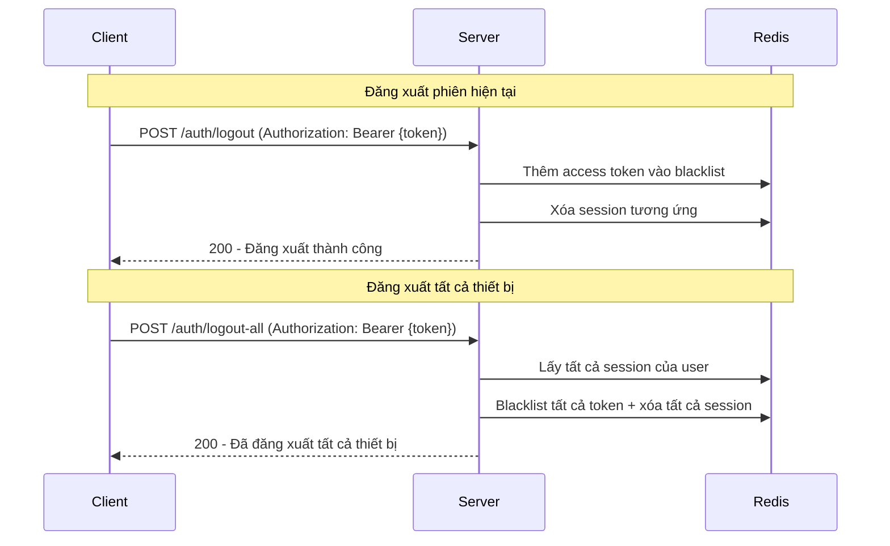
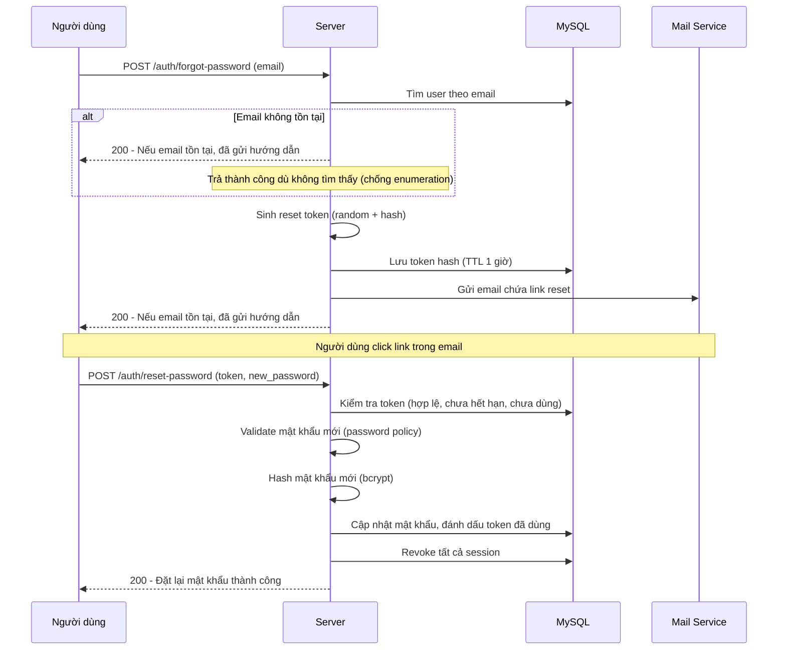
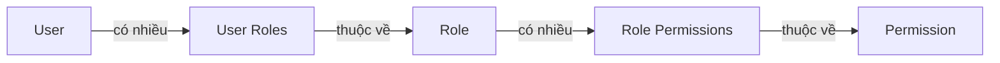
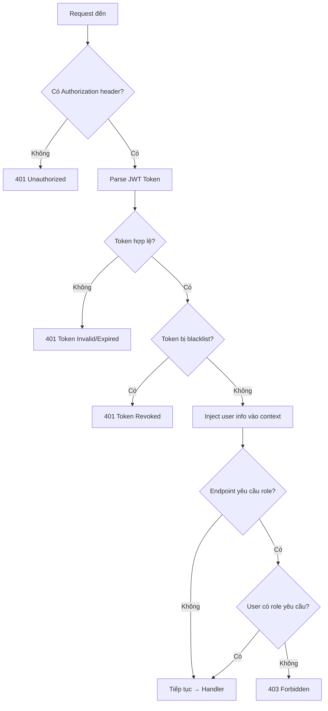

> [!IMPORTANT]
> **LƯU Ý DÀNH CHO DEVELOPER (AI & HUMAN):**
> Các tài liệu thiết kế này mang tính chất là **KHUNG ĐỊNH HƯỚNG (Framework / Guidelines)**.
> KHÔNG ĐƯỢC áp dụng một cách rập khuôn, máy móc hoặc sao chép hoàn toàn 100%.
> Tùy thuộc vào bối cảnh thực tế của task, bạn phải linh hoạt tùy biến (ví dụ: dùng Atomic Query, Pessimistic Locking FOR UPDATE cho Concurrency, hoặc cấu trúc lại struct).

# Luồng xác thực & Phân quyền

## 1. Tổng quan

Hệ thống sử dụng **JWT (JSON Web Token)** cho xác thực, kết hợp **Refresh Token Rotation** để duy trì phiên đăng nhập an toàn. Phân quyền theo mô hình **RBAC (Role-Based Access Control)** kết hợp **Permission-Based Authorization**.

---

## 2. Luồng đăng ký & Xác thực email



---

## 3. Luồng đăng nhập



---

## 4. Cấu trúc JWT Access Token

### Header

```json
{
  "alg": "HS256",
  "typ": "JWT"
}
```

### Payload (Claims)

```json
{
  "sub": 1,
  "username": "nguyenvana",
  "email": "nguyenvana@example.com",
  "roles": ["user"],
  "iat": 1700000000,
  "exp": 1700000900
}
```

| Claim | Mô tả |
|-------|-------|
| `sub` | User ID (uint64) |
| `username` | Tên đăng nhập |
| `email` | Email |
| `roles` | Danh sách vai trò |
| `iat` | Thời điểm tạo (Unix timestamp) |
| `exp` | Thời điểm hết hạn (Unix timestamp) |

### Cấu hình token

| Loại | Thời hạn | Nơi lưu |
|------|----------|---------|
| Access Token | 15 phút | Client (header Authorization) |
| Refresh Token | 7 ngày | Client (httpOnly cookie hoặc body) |

---

## 5. Luồng Refresh Token



### Refresh Token Rotation

- Mỗi lần refresh → tạo access & refresh token mới, cập nhật trực tiếp session cũ trong MySQL bằng query UPDATE (chuyển đổi nguyên tử).
- Nếu refresh token bị sử dụng trái phép hoặc bị thu hồi (không tìm thấy session nào khớp), server trả về lỗi `ERR_REFRESH_INVALID` (401).
- Đảm bảo tính toàn vẹn dữ liệu (ACID) bằng cơ chế cập nhật trực tiếp thay vì xóa rồi tạo mới.

---

## 6. Luồng đăng xuất



---

## 7. Luồng quên mật khẩu



---

## 8. Mô hình phân quyền RBAC

### Quan hệ



**User → Role → Permission**: Người dùng được gán vai trò, mỗi vai trò có danh sách quyền cụ thể.

### Vai trò mặc định

| Vai trò | Mô tả | Quyền chính |
|---------|-------|-------------|
| `admin` | Quản trị viên cao nhất | Toàn quyền |
| `moderator` | Quản lý nội dung | Xem/sửa user, xem audit logs |
| `user` | Người dùng thường | Chỉ quản lý thông tin cá nhân |

### Ma trận quyền (Permission Matrix)

| Permission | Admin | Moderator | User |
|-----------|-------|-----------|------|
| `users.read` (xem danh sách user) | ✅ | ✅ | ❌ |
| `users.create` (tạo user) | ✅ | ❌ | ❌ |
| `users.update` (sửa user) | ✅ | ✅ | ❌ |
| `users.delete` (xóa user) | ✅ | ❌ | ❌ |
| `users.notify` (gửi thông báo) | ✅ | ❌ | ❌ |
| `roles.read` (xem vai trò) | ✅ | ✅ | ❌ |
| `roles.create` (tạo vai trò) | ✅ | ❌ | ❌ |
| `roles.update` (sửa vai trò) | ✅ | ❌ | ❌ |
| `roles.delete` (xóa vai trò) | ✅ | ❌ | ❌ |
| `audit_logs.read` (xem logs) | ✅ | ✅ | ❌ |
| `audit_logs.export` (export logs) | ✅ | ❌ | ❌ |
| `profile.read` (xem hồ sơ cá nhân) | ✅ | ✅ | ✅ |
| `profile.update` (sửa hồ sơ cá nhân) | ✅ | ✅ | ✅ |

### Luồng kiểm tra quyền (Middleware)



---

## 9. Bảo mật bổ sung

### Chống Brute Force

| Cơ chế | Chi tiết |
|--------|---------|
| Khóa tài khoản | Sau 10 lần sai → khóa 15 phút |
| Rate Limiting | Login: 15 req/phút/IP (Ban IP 15p nếu > 50 req) |
| Rate Limit Cứng | Cho phép sai 3-5 lần (Token Bucket) thay vì block ngay lần đầu |

### Password Policy

| Quy tắc | Giá trị |
|---------|---------|
| Độ dài tối thiểu | 8 ký tự |
| Chữ hoa | Ít nhất 1 |
| Chữ thường | Ít nhất 1 |
| Chữ số | Ít nhất 1 |
| Ký tự đặc biệt | Ít nhất 1 (`@#$%^&*!`) |
| Không trùng mật khẩu cũ | Có |

### Token Security

| Biện pháp | Mô tả |
|-----------|-------|
| Hash token trước khi lưu DB | Dùng SHA-256, không lưu token plaintext |
| Refresh Token Rotation | Token cũ bị vô hiệu ngay sau khi dùng bằng câu lệnh UPDATE |
| Blacklist khi logout | Token bị blacklist trong Redis đến khi hết hạn |
| Redis Fail-Open | Nếu Redis sập, hệ thống ghi log warning/error và bỏ qua kiểm tra blacklist (vẫn cho phép request đi qua nếu chữ ký JWT hợp lệ) |
